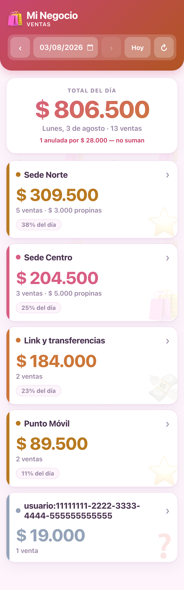
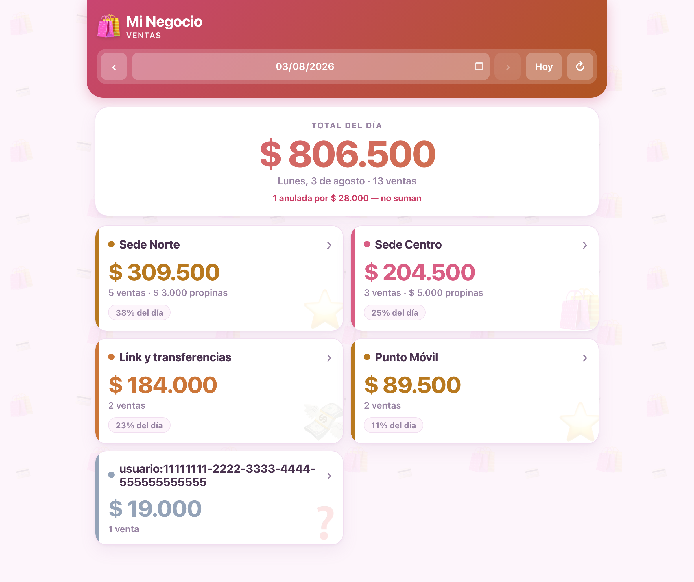
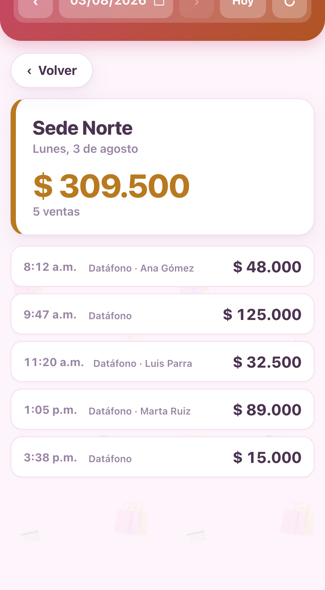

# Ventas Bold por datáfono

Dashboard de ventas en tiempo real para negocios con **varios datáfonos Bold**.
Bold no permite ver cuánto vendió cada terminal por separado; este sistema sí.

Corre sobre Cloudflare Workers + D1. Sin servidor que mantener, sin build, sin
dependencias en el navegador. Con 30–40 transacciones diarias opera muy por
debajo del plan gratuito.

<p align="center">
  
</p>

---

## El problema

Un negocio con tres puntos de venta tiene tres datáfonos Bold en la misma cuenta.
El panel de Bold muestra el total consolidado y una lista plana de transacciones:
para saber cuánto entró en cada punto hay que exportar el Excel y sumar a mano,
al día siguiente.

Lo que el dueño necesita es distinto: **saber ahora mismo cuánto lleva vendido
cada local**, para cuadrar contra lo que le reporta cada empleado al cierre.

## La restricción técnica

La API de Bold **no expone el historial de transacciones**. Solo permite
consultar un pago puntual por su id, y únicamente durante las 24 horas
siguientes. No hay endpoint que responda "dame las ventas de hoy".

La única fuente en tiempo real son los **webhooks**: Bold notifica cada venta en
el momento en que ocurre. Eso invierte el diseño — el sistema no le pregunta a
Bold, Bold le avisa al sistema:

```
Datáfono → Bold → webhook (HMAC-SHA256) → Cloudflare Worker → D1 → Dashboard
```

Consecuencia directa: **si un webhook se pierde, la venta se pierde**. Buena
parte de las decisiones de abajo salen de ahí.

---

## Capturas

| Escritorio | Detalle de un local |
|---|---|
|  |  |

*Datos ficticios, generados con `docs/demo-seed.sql`.*

---

## Decisiones de diseño

### 1. Identificar el datáfono cuando el payload no lo dice

En pagos con **tarjeta**, el webhook trae `data.card.terminal_id`: identificación
directa del dispositivo.

En pagos por **QR** ese campo no viene. Tras revisar payloads reales, el mejor
discriminador disponible es `data.user_id`, que en la práctica corresponde al
dispositivo dueño del QR — pero la documentación de Bold no lo garantiza por
escrito.

Diseñar sobre una suposición no verificable es frágil. La salida fue no
comprometerse:

```js
export function claveTerminal(evento) {
  const d = evento.data || {};
  if (d.card && d.card.terminal_id) return `terminal:${d.card.terminal_id}`;
  if (d.user_id)                     return `usuario:${d.user_id}`;
  return 'desconocido';
}
```

Cada venta guarda además **el payload completo y crudo** en la columna `raw`. Si
mañana resulta que el discriminador correcto es otro campo, se recalcula hacia
atrás sobre `raw` sin haber perdido una sola venta. La suposición queda aislada
en una función de cuatro líneas, no repartida por todo el esquema.

### 2. Reconciliación automática con el reporte oficial

El serial físico del datáfono (`SONO1234`) solo aparece al día siguiente, en el
Excel que Bold deja descargar. Una venta QR entra en vivo bajo la clave
`usuario:<uuid>` y queda sin nombre.

En vez de pedirle al usuario que arregle eso a mano, el importador reusa la misma
ruta de escritura que el webhook, y el `UPSERT` hace el resto:

```sql
INSERT INTO transacciones (...) VALUES (...)
ON CONFLICT(payment_id) DO UPDATE SET
  clave_terminal = excluded.clave_terminal,
  monto          = excluded.monto,
  raw            = excluded.raw
```

Al importar el reporte del día, cada venta se reencuentra por `payment_id` y se
reetiqueta sola con su terminal real. Sin duplicados, sin intervención manual, y
sin una segunda ruta de código que mantener en sincronía.

### 3. Idempotencia y eventos fuera de orden

Bold reintenta los webhooks que fallan. Dos garantías cubren eso:

- **`payment_id` es la llave primaria.** Un reintento actualiza la fila, nunca
  duplica la venta.
- **Anulaciones adelantadas.** Si un `VOID_APPROVED` llega antes que la venta que
  anula (perfectamente posible con reintentos), no se descarta: queda en
  `anulaciones_pendientes` y se aplica cuando la venta aparezca.

```js
const res = await env.DB.prepare(
  'UPDATE transacciones SET anulada = 1 WHERE payment_id = ?'
).bind(objetivo).run();

if (!res.meta.changes) {
  await env.DB.prepare(
    'INSERT OR IGNORE INTO anulaciones_pendientes (payment_id, recibida_en) VALUES (?, ?)'
  ).bind(objetivo, new Date().toISOString()).run();
}
```

Esto no es teórico: durante la puesta en producción, un secreto mal configurado
hizo que el Worker rechazara los webhooks durante un día. Al corregirlo, Bold
reentregó los eventos pendientes y **las ventas perdidas entraron solas**.

### 4. Verificación de firma, y dejar rastro cuando falla

Sin verificar firma, cualquiera que conozca la URL podría inventar ventas. Bold
firma con HMAC-SHA256 sobre el base64 del cuerpo crudo; la comparación es de
tiempo constante para no filtrar información por el tiempo de respuesta:

```js
function comparacionConstante(a, b) {
  if (a.length !== b.length) return false;
  let dif = 0;
  for (let i = 0; i < a.length; i++) dif |= a.charCodeAt(i) ^ b.charCodeAt(i);
  return dif === 0;
}
```

El detalle que costó un día de diagnóstico: la primera versión respondía `401` y
**no registraba nada**. Con la llave mal cargada, Bold entregaba correctamente,
el Worker rechazaba, y desde afuera el síntoma era idéntico a "Bold no está
mandando nada". Un fallo silencioso es indistinguible de la ausencia de fallo.
Ahora todo intento rechazado queda en `eventos_log` con su payload:

```js
if (!(await firmaValida(cuerpo, firma, env.BOLD_SECRET_KEY))) {
  await logEvento(env, null, null, 0, 'firma invalida', cuerpo);
  return json({ error: 'firma invalida' }, 401);
}
```

### 5. Responder rápido, fallar sin perder

Bold exige HTTP 200 en menos de 2 segundos o reintenta. El handler nunca propaga
una excepción: si el procesamiento falla, el error se registra junto al payload
crudo y **igual responde 200**, porque el evento ya está guardado y reprocesable.
Todo evento recibido queda en `eventos_log`, se haya procesado bien o mal.

### 6. Zona horaria explícita

El corte del día es Bogotá (UTC-5, sin horario de verano). La fecha se calcula al
guardar y se persiste en `fecha_venta`, en vez de derivarla en cada consulta:

```js
export function fechaBogota(iso) {
  const ms = Date.parse(iso);
  if (Number.isNaN(ms)) return new Date().toISOString().slice(0, 10);
  return new Date(ms + ZONA_OFFSET_HORAS * 3600 * 1000).toISOString().slice(0, 10);
}
```

Así el agrupamiento por día es un índice, no un cálculo por fila. El navegador
aplica la misma regla: una venta a las 11 p.m. cuenta para el día correcto sin
importar la zona horaria del celular que la consulta.

### 7. Frontend sin dependencias

El dashboard es HTML y CSS generados desde el Worker: sin React, sin build, sin
paquetes. El total pesa unos 10 KB comprimidos y carga en una sola petición.

La razón es de contexto: quien lo usa lo abre desde el celular, muchas veces con
datos móviles y mala señal. Cada kilobyte y cada petición extra se notan. El
patrón de fondo va como SVG embebido en un `data:` URI precisamente para no pedir
nada a la red.

Detalles pensados para uso real en la calle:

- Botones de mínimo 46 px de alto, para el dedo.
- Deslizar horizontalmente cambia de día.
- Refresco automático cada minuto, solo mientras se mira el día de hoy.
- Se refresca también al volver a la pestaña (`visibilitychange`), porque en
  móvil el temporizador se congela en segundo plano.
- Botón de recarga manual, para cuando el usuario quiere confirmar ya mismo.
- Color y emoji estables por local: derivados de un hash del nombre, así el mismo
  local siempre se ve igual sin necesidad de configurarlo.

---

## Arquitectura

```
src/index.js       Worker: webhook, API REST, importador, verificación de firma
src/dashboard.js   Dashboard completo (HTML + CSS + JS) generado en el servidor
schema.sql         Esquema D1: transacciones, locales, anulaciones, log de eventos
scripts/           Importador del Excel de Bold, con detección difusa de columnas
```

### Modelo de datos

| Tabla | Para qué |
|---|---|
| `transacciones` | Una fila por venta. `payment_id` como PK da idempotencia gratis. Guarda `raw` completo. |
| `locales` | Mapa `clave_terminal → nombre`. Varias claves pueden apuntar al mismo local. |
| `anulaciones_pendientes` | Anulaciones que llegaron antes que su venta. |
| `eventos_log` | Todo evento recibido, procesado o no, con su payload. |

Que **varias claves apunten al mismo local** es lo que permite que una venta
capturada por webhook (`usuario:abc`) y la misma venta vista en el reporte
(`reporte:SONO1234`) se sumen bajo un solo nombre.

### Rutas

| Ruta | Qué hace |
|---|---|
| `POST /webhook/bold` | Recibe eventos de Bold. Verifica firma HMAC-SHA256. |
| `POST /api/import` | Carga masiva desde el Excel. Protegida con token. |
| `GET /` | Dashboard. |
| `GET /api/resumen?desde=&hasta=` | Totales por local y por día. |
| `GET /api/transacciones?fecha=&grupo=` | Detalle de un local en un día. |
| `GET /api/terminales` | Claves detectadas y su nombre. |
| `POST /api/terminales` | Asigna nombre a una clave. |
| `GET /api/eventos` | Últimos 50 eventos recibidos. Diagnóstico. |
| `GET /salud` | Health check. |

---

## Importador del reporte de Bold

Los webhooks solo capturan desde que se activan. Para el histórico previo, el
script lee el Excel del panel de Bold.

Los encabezados de ese reporte traen tildes, mayúsculas inconsistentes y montos
como `$ 1.234.567,00`. En vez de asumir posiciones fijas de columna, el script
normaliza y busca por aproximación:

```js
const normalizar = (s) =>
  String(s).toLowerCase().normalize('NFD')
    .replace(/[̀-ͯ]/g, '')
    .replace(/[^a-z0-9]/g, '');
```

También localiza la fila de encabezados **por contenido**, no por número, así
sigue funcionando si Bold agrega filas de título. Si aun así no reconoce una
columna, imprime los encabezados y **se detiene sin cargar nada** — mejor fallar
visible que importar datos mal mapeados.

```bash
node scripts/import-report.mjs reporte.xlsx --columnas   # ver encabezados
node scripts/import-report.mjs reporte.xlsx --dry        # ensayo, no envía nada
node scripts/import-report.mjs reporte.xlsx --url ... --token ...
```

---

## Instalación

```bash
npm install
npx wrangler login
npx wrangler d1 create ventas-mi-negocio     # copiar el database_id

cp wrangler.toml.example wrangler.toml       # y pegar el id
npm run db:init

npx wrangler secret put BOLD_SECRET_KEY      # llave secreta del panel de Bold
npx wrangler secret put ADMIN_TOKEN          # token del importador

npm run deploy
```

Después, en el panel de Bold → Integraciones: activar las llaves y registrar
`https://TU-WORKER.workers.dev/webhook/bold`.

Para identificar los datáfonos, una venta de prueba en cada local: las claves
nuevas aparecen en el dashboard y se les pone nombre una sola vez.

### Local

```bash
npm run db:init:local
npm run dev
```

---

## Notas de seguridad

- Los secretos se cargan con `wrangler secret put`: quedan cifrados en Cloudflare
  y nunca viven en el repositorio.
- `wrangler.toml` está en `.gitignore` — solo se versiona el `.example`.
- Firma HMAC verificada en todo webhook, con comparación de tiempo constante.
- El importador exige token propio, distinto del secreto del webhook.

---

## Stack

Cloudflare Workers · D1 (SQLite) · JavaScript sin dependencias en el navegador ·
`xlsx` solo en el script de importación (nunca se despliega).

## Licencia

MIT
